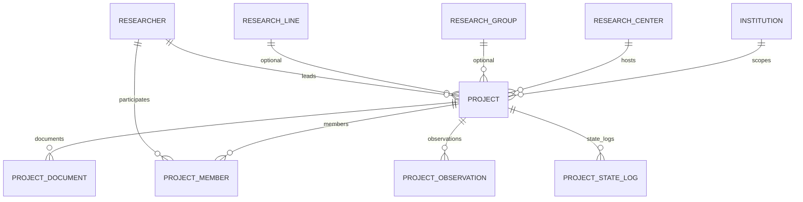

# Design: Projects Module (SIGPI §6.4)

## Technical Approach

Research project lifecycle as the fourth MVP module and SIGPI's core workflow. Follows the institution-scoped pattern (denormalized `institution_id` for RLS) but does NOT inherit `InstitutionScopedModel` — that base carries `code`, `name`, `description`, and a 3-state FSM (`active`/`deactivated`/`archived`), none of which apply to a project. Project has its own 12-state FSM via `django-fsm`, rich metadata fields, and four child entities. All state transitions centralized in `ProjectService` — views never call FSM directly. `ProjectStateLog` captures domain-specific transitions; each transition also emits an `AuditEvent` for cross-module audit consistency.

## Architecture Decisions

| Decision | Option A | Option B | Choice | Rationale |
|----------|----------|----------|--------|-----------|
| Model base class | Inherit `InstitutionScopedModel` | Standalone model with `institution` FK | **Standalone** | InstitutionScopedModel carries `code`, `name`, `description`, 3-state FSM — none apply. Project has 12-state FSM + rich metadata. Forced inheritance adds dead columns. |
| State audit log | Reuse `AuditEvent` only | Dedicated `ProjectStateLog` + `AuditEvent` mirror | **Dual: `ProjectStateLog` + mirror** | Domain log is queryable by project/from_state/to_state with natural FK. `AuditEvent` mirror preserves cross-module audit consistency. Matches explore.md recommendation. |
| "Observe" vs "Return to draft" | Same action | Separate actions | **Separate** | `observe()` creates `ProjectObservation` + transitions to `observado`. `return_to_draft()` transitions to `borrador` without observation. User-confirmed. |
| Member type model | Nullable `researcher` FK + name/email fallback | Non-null `researcher` FK only | **Non-null FK** | Students/seedbeds/collaborators are always `Researcher` profiles. User-confirmed. Simplifies queries, preserves referential integrity. |
| Nested route style | `drf-nested-routers` | Manual `path()` like researchers | **Manual `path()`** | Follow existing convention — zero new dependencies. |
| Permission class location | Keep `IsProjectOwnerOrCoInvestigator` in `accounts` | Move to `projects/permissions.py` | **Move to `projects`** | Avoids cross-app circular imports. Current `accounts` version references non-existent fields (`lead_researcher`). |
| Filtering approach | Meilisearch | DRF `django-filter` + `SearchFilter` + `OrderingFilter` | **DRF filtering** | Meilisearch dependency not in `pyproject.toml`. Deferred to post-MVP "Search Integration" change. |
| Document storage | MinIO/S3 file upload | Metadata-only `external_url` | **Metadata-only** | Matches `ResearcherAttachment` pattern. File upload infra deferred to post-MVP "Document Storage" change. |

## Data Model



### Project (`projects_project`)

| Field | Type | Constraints |
|-------|------|-------------|
| `id` | `UUIDField` | PK, `default=uuid4` |
| `institution` | `FK(Institution)` | `related_name='projects'` |
| `center` | `FK(ResearchCenter)` | non-null (RN-008), `related_name='projects'` |
| `group` | `FK(ResearchGroup)` | `null=True, blank=True` |
| `line` | `FK(ResearchLine)` | `null=True, blank=True` |
| `principal_investigator` | `FK(Researcher)` | non-null (RN-007), `related_name='led_projects'` |
| `title` | `CharField(255)` | required |
| `abstract` | `TextField` | required |
| `objectives` | `TextField` | required |
| `methodology` | `TextField` | required |
| `expected_results` | `TextField` | required |
| `keywords` | `CharField(500)` | `blank=True` |
| `start_date` | `DateField` | required |
| `estimated_end_date` | `DateField` | required; DB CHECK `>= start_date` (RN-013) |
| `actual_end_date` | `DateField` | `null=True, blank=True`; DB CHECK `IS NULL OR >= start_date` |
| `status` | `FSMField` | `default='borrador'`, `protected=False` |
| `is_active` | `BooleanField` | `default=True` |
| `created_at` | `DateTimeField` | `auto_now_add` |
| `updated_at` | `DateTimeField` | `auto_now` |

**Indexes**: `(institution, status)`, `(center, status)`, `(principal_investigator)`.

**`clean()` validation**:
- RN-007: `principal_investigator` non-null.
- RN-008: `center` non-null.
- RN-013: `estimated_end_date >= start_date`; `actual_end_date IS None OR actual_end_date >= start_date`.
- Hierarchy integrity: if `group` is set, `group.center_id == center_id` or `group.institution_id == institution_id`. If `line` is set, `line.group` belongs to same chain.

### ProjectMember (`projects_projectmember`)

| Field | Type | Constraints |
|-------|------|-------------|
| `id` | `UUIDField` | PK |
| `project` | `FK(Project)` | `related_name='members'`, CASCADE |
| `researcher` | `FK(Researcher)` | non-null, `related_name='project_memberships'` |
| `role` | `CharField(30)` | `choices=ProjectRole.choices` |
| `joined_at` | `DateTimeField` | `auto_now_add` |

**Constraints**: `UniqueConstraint(project, researcher)`.
**ProjectRole**: `co_investigator`, `student`, `seedbed`, `collaborator`.

### ProjectDocument (`projects_projectdocument`)

| Field | Type | Constraints |
|-------|------|-------------|
| `id` | `UUIDField` | PK |
| `project` | `FK(Project)` | `related_name='documents'`, CASCADE |
| `name` | `CharField(255)` | required |
| `doc_type` | `CharField(20)` | `choices=ProjectDocumentType.choices` |
| `external_url` | `URLField(500)` | required |
| `uploaded_at` | `DateTimeField` | `auto_now_add` |

**ProjectDocumentType**: `proposal`, `annex`, `contract`, `report`, `other`.

### ProjectObservation (`projects_projectobservation`)

| Field | Type | Constraints |
|-------|------|-------------|
| `id` | `UUIDField` | PK |
| `project` | `FK(Project)` | `related_name='observations'`, CASCADE |
| `observed_by` | `FK(User)` | `SET_NULL, null=True` |
| `observation_text` | `TextField` | required |
| `created_at` | `DateTimeField` | `auto_now_add` |

**Append-only**: no update/delete endpoints (RN-014).

### ProjectStateLog (`projects_projectstatelog`)

| Field | Type | Constraints |
|-------|------|-------------|
| `id` | `UUIDField` | PK |
| `project` | `FK(Project)` | `related_name='state_logs'`, CASCADE |
| `from_state` | `CharField(30)` | required |
| `to_state` | `CharField(30)` | required |
| `triggered_by` | `FK(User)` | `SET_NULL, null=True` |
| `reason` | `TextField` | `blank=True` |
| `created_at` | `DateTimeField` | `auto_now_add` |

**Append-only**. Indexes: `(project, -created_at)`, `(from_state, to_state)`.

## FSM Design

```
borrador ──submit()──→ enviado ──accept_review()──→ en_revision
    ↑                                                    │
    │                                    ┌───────────────┼───────────────┐
    │                                    ↓               ↓               ↓
    │                               aprobado       observado        rechazado
    │                                    │               │          (terminal)
    │                                    │               │
    │                              start_execution()  resubmit()──→ enviado
    │                                    │               │
    │                                    ↓          return_to_draft()
    │                              en_ejecucion          │
    │                                │       │           ↓
    │                          suspend()   finalize()  borrador
    │                                │       │
    │                                ↓       ↓
    │                          suspendido  finalizado
    │                                │       │
    │                          resume()  initiate_closure()
    │                                │       │
    │                                ↓       ↓
    │                          en_ejecucion  en_cierre
    │                                          │
    │                                       close()
    │                                          │
    │                                          ↓
    │                                       cerrado
    │                                      (terminal)
    │
    └── Any non-terminal ──cancel(reason)──→ cancelado (terminal)
```

### Transition Table

| Source | Target | Trigger | Guard | Side Effects |
|--------|--------|---------|-------|--------------|
| `borrador` | `enviado` | `submit()` | PI set; center set; dates valid (RN-013) | `ProjectStateLog`; `AuditEvent` |
| `enviado` | `en_revision` | `accept_review()` | `IsCenterDirectorForProject` | `ProjectStateLog`; `AuditEvent` |
| `en_revision` | `aprobado` | `approve()` | `IsCenterDirectorForProject` | `ProjectStateLog`; `AuditEvent` |
| `en_revision` | `observado` | `observe(text)` | `IsCenterDirectorForProject` | Create `ProjectObservation`; `ProjectStateLog`; `AuditEvent` |
| `en_revision` | `borrador` | `return_to_draft()` | `IsCenterDirectorForProject` | `ProjectStateLog`; `AuditEvent` |
| `en_revision` | `rechazado` | `reject()` | `IsCenterDirectorForProject` | Terminal; `ProjectStateLog`; `AuditEvent` |
| `observado` | `enviado` | `resubmit()` | PI or Admin | `ProjectStateLog`; `AuditEvent` |
| `observado` | `borrador` | `return_to_draft()` | `IsCenterDirectorForProject` | `ProjectStateLog`; `AuditEvent` |
| `aprobado` | `en_ejecucion` | `start_execution()` | Admin | `ProjectStateLog`; `AuditEvent` |
| `en_ejecucion` | `suspendido` | `suspend(reason)` | Director or Admin | `ProjectStateLog`; `AuditEvent` |
| `suspendido` | `en_ejecucion` | `resume()` | Director or Admin | `ProjectStateLog`; `AuditEvent` |
| `en_ejecucion` | `finalizado` | `finalize(date)` | PI or Admin; `actual_end_date` set | `ProjectStateLog`; `AuditEvent` |
| `finalizado` | `en_cierre` | `initiate_closure()` | `IsCenterDirectorForProject` | `ProjectStateLog`; `AuditEvent` |
| `en_cierre` | `cerrado` | `close()` | `IsCenterDirectorForProject` | Terminal; `ProjectStateLog`; `AuditEvent` |
| Any non-terminal | `cancelado` | `cancel(reason)` | Admin (level ≤ 2) | Terminal; `ProjectStateLog`; `AuditEvent` |

**Terminal states**: `cerrado`, `rechazado`, `cancelado`. No outbound transitions.

**FSM implementation**: `@transition` decorators on `Project` model methods. `protected=False` allows admin repair. Views NEVER call these directly — all go through `ProjectService`.

## Service Layer

### ProjectService

```python
class ProjectService:
    @staticmethod
    def create(institution, center, principal_investigator, user, **data) -> Project:
        """Validate RN-007, RN-008, RN-009, RN-013. Set status='borrador'."""

    @staticmethod
    def update(project, **data) -> Project:
        """Reject if terminal (RN-011). Delegate to model clean() + save()."""

    # — FSM orchestration (each calls model transition + logs + audit) —
    @staticmethod
    def submit(project, user) -> Project: ...

    @staticmethod
    def accept_review(project, user) -> Project: ...

    @staticmethod
    def approve(project, user) -> Project: ...

    @staticmethod
    def observe(project, user, observation_text) -> Project:
        """Transition + create ProjectObservation."""

    @staticmethod
    def return_to_draft(project, user) -> Project:
        """Transition to borrador WITHOUT creating observation."""

    @staticmethod
    def reject(project, user) -> Project: ...

    @staticmethod
    def resubmit(project, user) -> Project: ...

    @staticmethod
    def start_execution(project, user) -> Project: ...

    @staticmethod
    def suspend(project, user, reason="") -> Project: ...

    @staticmethod
    def resume(project, user) -> Project: ...

    @staticmethod
    def finalize(project, user, actual_end_date) -> Project: ...

    @staticmethod
    def initiate_closure(project, user) -> Project: ...

    @staticmethod
    def close(project, user) -> Project: ...

    @staticmethod
    def cancel(project, user, reason="") -> Project: ...

    @staticmethod
    def _log_transition(project, from_state, to_state, user, reason=""):
        """Create ProjectStateLog + emit AuditEvent. Private helper."""
```

Each FSM method follows the same pattern:
1. Call `project.<transition_method>()` (django-fsm `@transition`).
2. `project.save()`.
3. `_log_transition(...)` — creates `ProjectStateLog` row.
4. `AuditEventEmitter().emit(event_type="PROJECT_STATE_CHANGE", ...)` — mirrors to global audit.

### ProjectMemberService

```python
class ProjectMemberService:
    @staticmethod
    def add(project, researcher, role) -> ProjectMember:
        """Validate project not terminal (RN-011). Enforce unique (project, researcher)."""

    @staticmethod
    def update(member, role) -> ProjectMember:
        """Validate parent project not terminal."""

    @staticmethod
    def remove(member) -> None:
        """Validate parent project not terminal."""
```

### ProjectDocumentService

```python
class ProjectDocumentService:
    @staticmethod
    def add(project, name, doc_type, external_url) -> ProjectDocument:
        """Validate project not terminal (RN-011)."""

    @staticmethod
    def update(document, **data) -> ProjectDocument:
        """Validate parent project not terminal."""

    @staticmethod
    def remove(document) -> None:
        """Validate parent project not terminal."""
```

## API Design

### ViewSets & Permissions

| ViewSet | Permission Classes | Notes |
|---------|-------------------|-------|
| `ProjectViewSet` | Action-specific via `get_permissions()` | 16 FSM actions as `@action(detail=True, methods=['post'])` |
| `ProjectMemberViewSet` | `[IsAuthenticated, IsProjectOwnerOrCoInvestigator, IsProjectEditable]` | Nested under `/projects/{pk}/members/` |
| `ProjectDocumentViewSet` | `[IsAuthenticated, IsProjectOwnerOrCoInvestigator, IsProjectEditable]` | Nested under `/projects/{pk}/documents/` |
| `ProjectObservationViewSet` | `[IsAuthenticated]` (read-only) | Nested under `/projects/{pk}/observations/` |
| `ProjectStateLogViewSet` | `[IsAuthenticated]` (read-only) | Nested under `/projects/{pk}/state_history/` |

### Permission Classes

```python
class IsProjectOwnerOrCoInvestigator(BasePermission):
    """User is PI (principal_investigator.user == request.user)
    OR co_investigator member (members.filter(researcher__user=user, role='co_investigator')).
    Admin+ (level ≤ 2) bypasses."""

class IsCenterDirectorForProject(BasePermission):
    """User's membership includes project's center with Director role (level ≤ 3).
    Checks obj.center_id against membership.centers. Reuses IsCenterDirector pattern."""

class CanCreateProjectInCenter(BasePermission):
    """User has Researcher role (level ≤ 4) AND has ResearcherAffiliation
    with the target center (RN-009)."""

class IsProjectEditable(BasePermission):
    """Object-level: returns False if project.status in terminal states
    AND user is not Admin+ (level ≤ 2). Enforces RN-011.
    Applied to ProjectMemberViewSet and ProjectDocumentViewSet,
    checking the PARENT project's status."""
```

### URL Routing

```
/projects/                                    GET, POST
/projects/{id}/                               GET, PATCH, DELETE
/projects/{id}/submit/                        POST
/projects/{id}/accept_review/                 POST
/projects/{id}/approve/                       POST
/projects/{id}/observe/                       POST  (body: observation_text)
/projects/{id}/return_to_draft/               POST
/projects/{id}/reject/                        POST
/projects/{id}/resubmit/                      POST
/projects/{id}/start_execution/               POST
/projects/{id}/suspend/                       POST  (body: reason)
/projects/{id}/resume/                        POST
/projects/{id}/finalize/                      POST  (body: actual_end_date)
/projects/{id}/initiate_closure/              POST
/projects/{id}/close/                         POST
/projects/{id}/cancel/                        POST  (body: reason)
/projects/{id}/members/                       GET, POST
/projects/{id}/members/{mid}/                 PATCH, DELETE
/projects/{id}/documents/                     GET, POST
/projects/{id}/documents/{did}/               PATCH, DELETE
/projects/{id}/observations/                  GET
/projects/{id}/state_history/                 GET
```

### Serializer Mapping

| Serializer | Use | Key Fields |
|-----------|-----|------------|
| `ProjectListSerializer` | List | id, title, status, center, principal_investigator, start_date, created_at |
| `ProjectSerializer` | Retrieve | All fields + nested members, documents (read-only) |
| `ProjectCreateSerializer` | Create/Update | Writable fields only; institution injected by view |
| `ProjectMemberSerializer` | Member CRUD | researcher, role (project read-only from URL) |
| `ProjectDocumentSerializer` | Document CRUD | name, doc_type, external_url (project read-only) |
| `ProjectObservationSerializer` | Observation list (read-only) | observed_by, observation_text, created_at |
| `ProjectStateLogSerializer` | State history list (read-only) | from_state, to_state, triggered_by, reason, created_at |

### Filtering (RF-039)

```python
class ProjectFilter(django_filters.FilterSet):
    status = django_filters.ChoiceFilter(choices=ProjectStatus.choices)
    center = django_filters.UUIDFilter(field_name="center_id")
    start_date_after = django_filters.DateFilter(field_name="start_date", lookup_expr="gte")
    start_date_before = django_filters.DateFilter(field_name="start_date", lookup_expr="lte")
    keywords = django_filters.CharFilter(field_name="keywords", lookup_expr="icontains")

    class Meta:
        model = Project
        fields = ["status", "center", "start_date_after", "start_date_before", "keywords"]
```

ViewSet also uses `SearchFilter` (search_fields: title, abstract, keywords) and `OrderingFilter` (ordering_fields: title, start_date, created_at, status).

## Security

### RLS Policies

5 new tables added to tenant isolation:

```sql
-- Parent table (direct institution_id column):
ALTER TABLE projects_project ENABLE ROW LEVEL SECURITY;
CREATE POLICY tenant_isolation ON projects_project
    USING (institution_id = current_setting('sigpi.institution_id')::uuid);
CREATE POLICY superadmin_bypass ON projects_project
    USING (COALESCE(current_setting('sigpi.bypass_rls', true), 'false')::bool = true);

-- Child tables (reach institution via project_id FK subquery):
-- Applied to: projects_projectmember, projects_projectdocument,
--             projects_projectobservation, projects_projectstatelog
CREATE POLICY tenant_isolation ON {table}
    USING (project_id IN (
        SELECT id FROM projects_project
        WHERE institution_id = current_setting('sigpi.institution_id')::uuid
    ));
CREATE POLICY superadmin_bypass ON {table}
    USING (COALESCE(current_setting('sigpi.bypass_rls', true), 'false')::bool = true);
```

### Permission Matrix

| Action | Superadmin | Admin | Center Director | PI | Co-Investigator | Other |
|--------|:---:|:---:|:---:|:---:|:---:|:---:|
| Create project | ✅ | ✅ | ❌ | ✅ (RN-009) | ❌ | ❌ |
| Update (non-terminal) | ✅ | ✅ | ❌ | ✅ | ✅ | ❌ |
| Update (terminal) | ✅ | ✅ | ❌ | ❌ | ❌ | ❌ |
| Delete (borrador only) | ✅ | ✅ | ❌ | ✅ | ❌ | ❌ |
| Submit / Resubmit | ✅ | ✅ | ❌ | ✅ | ❌ | ❌ |
| Accept review | ✅ | ✅ | ✅ (RN-010) | ❌ | ❌ | ❌ |
| Approve / Reject | ✅ | ✅ | ✅ (RN-010) | ❌ | ❌ | ❌ |
| Observe | ✅ | ✅ | ✅ (RN-010) | ❌ | ❌ | ❌ |
| Return to draft | ✅ | ✅ | ✅ (RN-010) | ❌ | ❌ | ❌ |
| Start / Suspend / Resume | ✅ | ✅ | ✅ | ❌ | ❌ | ❌ |
| Finalize | ✅ | ✅ | ❌ | ✅ | ❌ | ❌ |
| Initiate closure / Close | ✅ | ✅ | ✅ (RN-010) | ❌ | ❌ | ❌ |
| Cancel | ✅ | ✅ | ❌ | ❌ | ❌ | ❌ |
| Manage members/docs | ✅ | ✅ | ❌ | ✅ | ✅ | ❌ |
| View observations/history | ✅ | ✅ | ✅ | ✅ | ✅ | ✅ (inst.) |

**Enforcement mapping**:
- Create → `CanCreateProjectInCenter`
- Update/Delete → `IsProjectOwnerOrCoInvestigator` + `IsProjectEditable`
- FSM director actions → `IsCenterDirectorForProject`
- FSM PI actions → `IsProjectOwnerOrCoInvestigator`
- FSM admin actions → `HasRoleLevelOrHigher(2)`
- Nested mutations → `IsProjectOwnerOrCoInvestigator` + `IsProjectEditable` (checks parent)
- Read-only nested → `IsAuthenticated` (institution scoping via queryset + RLS)

## Migration Plan

| Migration | Depends On | Content |
|-----------|-----------|---------|
| `projects/0001_initial.py` | `accounts.0003`, `institutions.0002`, `researchers.0001` | Create 5 tables: Project, ProjectMember, ProjectDocument, ProjectObservation, ProjectStateLog. DB CHECK constraints for dates. Indexes. |
| `projects/0002_rls_policies.py` | `projects.0001` | Enable RLS + tenant_isolation + superadmin_bypass on 5 tables. Parent: direct `institution_id`. Children: subquery via `project_id`. |

## Testing Strategy

| Layer | What | Approach |
|-------|------|----------|
| **Factories** | `ProjectFactory`, `ProjectMemberFactory`, `ProjectDocumentFactory`, `ProjectObservationFactory`, `ProjectStateLogFactory` | factory-boy in `conftest.py` |
| **Model tests** | `clean()` validations (RN-007, RN-008, RN-013, hierarchy), unique constraints, DB CHECK constraints | pytest-django |
| **FSM tests** | Every valid transition succeeds; every invalid transition fails; terminal states block outbound | Unit tests with project fixtures in each state |
| **Service tests** | CRUD operations, all 15 transition methods, `_log_transition` creates both logs, guard enforcement | Unit tests; mock `AuditEventEmitter` for isolation |
| **Serializer tests** | Field validation, nested read-only serialization, list vs detail output | DRF test utilities |
| **Permission tests** | Full role × action matrix (15 actions × 6 roles = 90 cells) | Fixture-based with role factories |
| **View tests** | CRUD endpoints, 16 FSM action endpoints, nested routes, error responses (400, 403, 409) | APIClient with authenticated users |
| **RLS tests** | Cross-institution query returns empty at DB level | PostgreSQL test DB with `SET ROLE sigpi_app` |
| **URL tests** | Route resolution, nested path correctness, all 22 URL patterns | Django `reverse()` assertions |

**Coverage target**: ≥80% (pytest-cov).

## File Changes

| File | Action | Description |
|------|--------|-------------|
| `backend/apps/projects/__init__.py` | Create | Package init |
| `backend/apps/projects/apps.py` | Create | `ProjectsConfig` |
| `backend/apps/projects/models.py` | Create | 5 models + 3 enums (ProjectStatus, ProjectRole, ProjectDocumentType) + FSM `@transition` methods |
| `backend/apps/projects/services.py` | Create | ProjectService (CRUD + 15 FSM methods + `_log_transition`), ProjectMemberService, ProjectDocumentService |
| `backend/apps/projects/serializers.py` | Create | 7 serializers (list, detail, create, member, document, observation, state_log) |
| `backend/apps/projects/views.py` | Create | 5 ViewSets: ProjectViewSet (CRUD + 16 actions), Member, Document, Observation (read-only), StateLog (read-only) |
| `backend/apps/projects/permissions.py` | Create | 4 permission classes: IsProjectOwnerOrCoInvestigator, IsCenterDirectorForProject, CanCreateProjectInCenter, IsProjectEditable |
| `backend/apps/projects/filters.py` | Create | `ProjectFilter` (django-filter FilterSet) |
| `backend/apps/projects/urls.py` | Create | Manual nested path routing (22 URL patterns) |
| `backend/apps/projects/admin.py` | Create | Register all 5 models |
| `backend/apps/projects/migrations/0001_initial.py` | Create | 5 tables, CHECK constraints, indexes |
| `backend/apps/projects/migrations/0002_rls_policies.py` | Create | RLS for 5 tables |
| `backend/apps/projects/tests/__init__.py` | Create | Test package |
| `backend/apps/projects/tests/conftest.py` | Create | 5 factory-boy factories + state fixtures |
| `backend/apps/projects/tests/test_models.py` | Create | Model constraint + validation + FSM transition tests |
| `backend/apps/projects/tests/test_services.py` | Create | Service layer tests (CRUD + all transitions) |
| `backend/apps/projects/tests/test_serializers.py` | Create | Serializer tests |
| `backend/apps/projects/tests/test_permissions.py` | Create | Full permission matrix tests (90 cells) |
| `backend/apps/projects/tests/test_views.py` | Create | ViewSet CRUD + FSM action + nested route tests |
| `backend/apps/projects/tests/test_urls.py` | Create | URL resolution tests |
| `backend/apps/projects/tests/test_rls.py` | Create | RLS policy tests |
| `backend/apps/projects/tests/test_admin.py` | Create | Admin registration tests |
| `backend/apps/accounts/permissions.py` | Modify | Remove `IsProjectOwnerOrCoInvestigator` (moved to projects) |
| `backend/config/settings/base.py` | Modify | Add `apps.projects` to `LOCAL_APPS`; add `django_filters` to `INSTALLED_APPS` if missing |
| `backend/config/urls.py` | Modify | Add `path("api/", include("apps.projects.urls"))` |
| `backend/pyproject.toml` | Modify | Add `django-filter` dependency if not present |

## Open Questions

- [ ] Should `AuditEventType` in `accounts/audit.py` add a `PROJECT_STATE_CHANGE` enum value, or should the projects app pass a raw string to `AuditEventEmitter.emit()`? Recommendation: add the enum value for type safety.
- [ ] Should `return_to_draft` from `observado` state also be allowed (spec says yes — director can return an observed project to draft)? Current design includes this transition.
