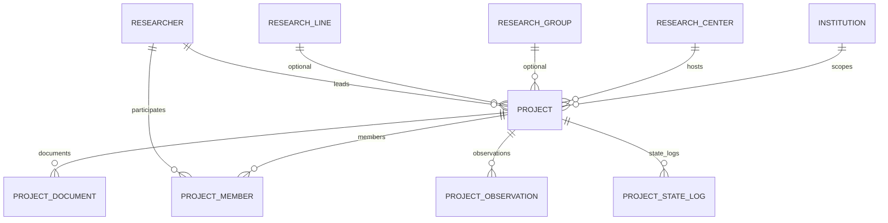

# Projects Module Specification (SIGPI §6.4)

## Overview
Manages the complete research project lifecycle — the fourth MVP module and core SIGPI workflow. Researchers create projects scoped to a center; center directors review, observe, approve, or reject them via a 12-state FSM. Depends on `accounts` (User, RLS, audit), `institutions` (hierarchy), and `researchers` (Researcher, affiliations).

## Functional Requirements

| Code | Requirement | Priority | Acceptance Criteria | Scenario |
|---|---|---|---|---|
| RF-027 | Create project | Must | PI and center are set; creator is affiliated with center (RN-009); initial status is `borrador` | **GIVEN** a Researcher affiliated with Center C **WHEN** they POST `/projects/` with title, abstract, objectives, methodology, expected_results, keywords, start_date, estimated_end_date, center, principal_investigator **THEN** a Project is created with `status="borrador"` |
| RF-028 | Update project | Must | Only PI, co-investigator, Admin, or Superadmin can update; mutations rejected if status is terminal (RN-011) | **GIVEN** a Project in `borrador` owned by Researcher R **WHEN** R PATCHes `/projects/{id}/` **THEN** fields are updated  **GIVEN** a Project in `cerrado` **WHEN** R PATCHes it **THEN** 403 "Project is closed" |
| RF-029 | Project metadata | Must | System stores and returns title, abstract, objectives, methodology, expected_results, keywords | **GIVEN** an existing Project **WHEN** GET `/projects/{id}/` **THEN** response contains all six metadata fields |
| RF-030 | Institution hierarchy association | Must | Project MUST be linked to Institution, Center; MAY link to Group and Line | **GIVEN** a create payload with `center`, `group`, `line` **THEN** the Project FKs resolve to entities within the same institution chain |
| RF-031 | Assign principal investigator | Must | `principal_investigator` is non-null (RN-007) and affiliated with the project's center (RN-009) | **GIVEN** a create payload without `principal_investigator` **THEN** 400 "Principal investigator is required"  **GIVEN** a PI not affiliated with the target center **THEN** 400 "PI must be affiliated with the center" |
| RF-032 | Associate co-investigators | Must | `ProjectMember` created with `role="co_investigator"` | **GIVEN** a Project in `borrador` **WHEN** PI POSTs `/projects/{id}/members/` with `researcher` and `role=co_investigator` **THEN** member is added |
| RF-033 | Associate students, seedbeds, collaborators | Must | `ProjectMember` created with roles `student`, `seedbed`, `collaborator`; `researcher` FK is non-null | **GIVEN** a Project in `borrador` **WHEN** PI POSTs `/projects/{id}/members/` with `role=student` **THEN** member is added |
| RF-034 | Manage project dates | Must | `start_date`, `estimated_end_date`, and optional `actual_end_date` stored; end dates ≥ start date (RN-013) | **GIVEN** a create payload where `estimated_end_date` < `start_date` **THEN** 400 "End date must be on or after start date" |
| RF-035 | FSM lifecycle | Must | 12 states managed by `django-fsm`; transitions guarded and audited (RN-012) | **GIVEN** a Project in `borrador` with valid PI and center **WHEN** PI POSTs `/projects/{id}/submit/` **THEN** status becomes `enviado` and a `ProjectStateLog` row is created |
| RF-036 | Document metadata | Must | `ProjectDocument` stores name, doc_type, external_url (no file upload in MVP) | **GIVEN** a Project in `borrador` **WHEN** PI POSTs `/projects/{id}/documents/` with `name`, `doc_type`, `external_url` **THEN** document metadata is stored |
| RF-037 | Submit for review | Must | PI or admin can trigger `borrador` → `enviado` | **GIVEN** a Project in `borrador` **WHEN** PI POSTs `/projects/{id}/submit/` **THEN** status is `enviado` |
| RF-038 | Director review actions | Must | Center director can approve, observe, return_to_draft, or reject projects in their center (RN-010) | **GIVEN** a Project in `en_revision` in Center C **WHEN** Director of C POSTs `/projects/{id}/observe/` with `observation_text` **THEN** status is `observado` AND a `ProjectObservation` is created  **GIVEN** a Project in `en_revision` **WHEN** Director POSTs `/projects/{id}/return_to_draft/` **THEN** status is `borrador` and no observation is created  **GIVEN** a Project in `en_revision` **WHEN** Director POSTs `/projects/{id}/reject/` **THEN** status is `rechazado` (terminal) |
| RF-039 | Advanced filtering | Must | DRF filtering supports status, center, dates, keywords; search and ordering enabled | **GIVEN** 3 Projects with statuses `borrador`, `aprobado`, `cerrado` **WHEN** GET `/projects/?status=aprobado` **THEN** only the approved project is returned |

## Business Rules

| Code | Rule |
|---|---|
| RN-007 | `principal_investigator` MUST be non-null. |
| RN-008 | `center` MUST be non-null. |
| RN-009 | A researcher MAY create projects only in centers where they have an affiliation. |
| RN-010 | Only a Center Director of the project's center MAY approve, observe, return, or reject the project. |
| RN-011 | A project in a terminal state (`cerrado`, `rechazado`, `cancelado`) MUST reject mutations by non-admin users. |
| RN-012 | Every state change MUST be recorded in `ProjectStateLog` AND mirrored to `AuditEvent`. |
| RN-013 | `estimated_end_date` and `actual_end_date` MUST be ≥ `start_date`. |
| RN-014 | Observations MUST be append-only; no update or delete endpoints. |

## Data Model

`Project` inherits from `InstitutionScopedModel` (denormalized `institution_id` for RLS).

| Entity | Key Fields | Constraints |
|---|---|---|
| **Project** | `id` (UUID PK), `institution` (FK→Institution), `center` (FK→ResearchCenter), `group` (FK→ResearchGroup, null), `line` (FK→ResearchLine, null), `principal_investigator` (FK→Researcher), `title`, `abstract`, `objectives`, `methodology`, `expected_results`, `keywords`, `start_date`, `estimated_end_date`, `actual_end_date` (null), `status` (FSMField), `is_active`, `created_at`, `updated_at` | `center` non-null; `principal_investigator` non-null; DB CHECK `estimated_end_date >= start_date`; DB CHECK `actual_end_date IS NULL OR actual_end_date >= start_date` |
| **ProjectMember** | `id` (UUID PK), `project` (FK→Project), `researcher` (FK→Researcher), `role` (TextChoices), `joined_at` | Unique `(project, researcher)` |
| **ProjectDocument** | `id` (UUID PK), `project` (FK→Project), `name`, `doc_type` (TextChoices), `external_url`, `uploaded_at` | — |
| **ProjectObservation** | `id` (UUID PK), `project` (FK→Project), `observed_by` (FK→User, SET_NULL), `observation_text`, `created_at` | Append-only; no update/delete endpoints |
| **ProjectStateLog** | `id` (UUID PK), `project` (FK→Project), `from_state`, `to_state`, `triggered_by` (FK→User, SET_NULL), `reason`, `created_at` | Append-only |

### Enumerations

- `ProjectRole`: `co_investigator`, `student`, `seedbed`, `collaborator`
- `ProjectDocumentType`: `proposal`, `annex`, `contract`, `report`, `other`
- `ProjectStatus` (FSM): `borrador`, `enviado`, `en_revision`, `observado`, `aprobado`, `en_ejecucion`, `suspendido`, `finalizado`, `en_cierre`, `cerrado`, `rechazado`, `cancelado`

## API Contract

| Endpoint | Method | Auth | Request Body | Response |
|---|---|---|---|---|
| `/projects/` | GET, POST | Session | `title`, `abstract`, `objectives`, `methodology`, `expected_results`, `keywords`, `start_date`, `estimated_end_date`, `center`, `group?`, `line?`, `principal_investigator` | List / Project |
| `/projects/{id}/` | GET, PATCH, DELETE | Session | partial fields | Project / 204 |
| `/projects/{id}/submit/` | POST | Session | — | Project |
| `/projects/{id}/accept_review/` | POST | Session | — | Project |
| `/projects/{id}/approve/` | POST | Session | — | Project |
| `/projects/{id}/observe/` | POST | Session | `observation_text` | Project |
| `/projects/{id}/return_to_draft/` | POST | Session | — | Project |
| `/projects/{id}/reject/` | POST | Session | — | Project |
| `/projects/{id}/resubmit/` | POST | Session | — | Project |
| `/projects/{id}/start_execution/` | POST | Session | — | Project |
| `/projects/{id}/suspend/` | POST | Session | `reason` | Project |
| `/projects/{id}/resume/` | POST | Session | — | Project |
| `/projects/{id}/finalize/` | POST | Session | `actual_end_date` | Project |
| `/projects/{id}/initiate_closure/` | POST | Session | — | Project |
| `/projects/{id}/close/` | POST | Session | — | Project |
| `/projects/{id}/cancel/` | POST | Session | `reason` | Project |
| `/projects/{id}/members/` | GET, POST | Session | `researcher`, `role` | List / Member |
| `/projects/{id}/members/{mid}/` | PATCH, DELETE | Session | `role` | Member / 204 |
| `/projects/{id}/documents/` | GET, POST | Session | `name`, `doc_type`, `external_url` | List / Document |
| `/projects/{id}/documents/{did}/` | PATCH, DELETE | Session | partial | Document / 204 |
| `/projects/{id}/observations/` | GET | Session | — | List Observation |
| `/projects/{id}/state_history/` | GET | Session | — | List StateLog |

## Security & Permissions

| Action | Superadmin | Admin | Center Director | PI | Co-Investigator | Other |
|---|---|---|---|---|---|---|
| Create project | ✓ | ✓ | — | ✓ (RN-009) | — | — |
| Update project (non-terminal) | ✓ | ✓ | — | ✓ | ✓ | — |
| Update project (terminal) | ✓ | ✓ | — | — | — | — |
| Delete project | ✓ | ✓ | — | ✓ (if borrador) | — | — |
| Submit / Resubmit | ✓ | ✓ | — | ✓ | — | — |
| Accept for review | ✓ | ✓ | ✓ (RN-010) | — | — | — |
| Approve / Reject | ✓ | ✓ | ✓ (RN-010) | — | — | — |
| Observe | ✓ | ✓ | ✓ (RN-010) | — | — | — |
| Return to draft | ✓ | ✓ | ✓ (RN-010) | — | — | — |
| Start / Suspend / Resume | ✓ | ✓ | ✓ | — | — | — |
| Finalize | ✓ | ✓ | — | ✓ | — | — |
| Initiate closure / Close | ✓ | ✓ | ✓ (RN-010) | — | — | — |
| Cancel | ✓ | ✓ | — | — | — | — |
| Manage members (non-terminal parent) | ✓ | ✓ | — | ✓ | ✓ | — |
| Manage documents (non-terminal parent) | ✓ | ✓ | — | ✓ | ✓ | — |
| View observations / state history | ✓ | ✓ | ✓ | ✓ | ✓ | ✓ (institution) |

Permission classes:
- `CanCreateProjectInCenter` — user is Researcher-level or above AND has affiliation with the target center.
- `IsProjectOwnerOrCoInvestigator` — user matches `principal_investigator` OR is a `co_investigator` member.
- `IsCenterDirectorForProject` — user's membership includes the project's center with Director role.
- `IsProjectEditable` — object-level; returns `False` if status is terminal and user is not Admin+.

## FSM Specification

| Source | Target | Trigger | Guard | Side Effects |
|---|---|---|---|---|
| `borrador` | `enviado` | `submit()` | PI set; center set; dates valid (RN-013) | Log state change; emit `AuditEvent` |
| `enviado` | `en_revision` | `accept_review()` | `IsCenterDirectorForProject` | Log; emit `AuditEvent` |
| `en_revision` | `aprobado` | `approve()` | `IsCenterDirectorForProject` | Log; emit `AuditEvent` |
| `en_revision` | `observado` | `observe(observation_text)` | `IsCenterDirectorForProject` | Create `ProjectObservation`; log; emit `AuditEvent` |
| `en_revision` | `borrador` | `return_to_draft()` | `IsCenterDirectorForProject` | Log; emit `AuditEvent` |
| `en_revision` | `rechazado` | `reject()` | `IsCenterDirectorForProject` | Terminal; log; emit `AuditEvent` |
| `observado` | `enviado` | `resubmit()` | PI or Admin | Log; emit `AuditEvent` |
| `observado` | `borrador` | `return_to_draft()` | `IsCenterDirectorForProject` | Log; emit `AuditEvent` |
| `aprobado` | `en_ejecucion` | `start_execution()` | Admin or system | Log; emit `AuditEvent` |
| `en_ejecucion` | `suspendido` | `suspend(reason)` | Director or Admin | Log; emit `AuditEvent` |
| `suspendido` | `en_ejecucion` | `resume()` | Director or Admin | Log; emit `AuditEvent` |
| `en_ejecucion` | `finalizado` | `finalize(actual_end_date)` | PI or Admin; `actual_end_date` set | Log; emit `AuditEvent` |
| `finalizado` | `en_cierre` | `initiate_closure()` | `IsCenterDirectorForProject` | Log; emit `AuditEvent` |
| `en_cierre` | `cerrado` | `close()` | `IsCenterDirectorForProject` | Terminal; log; emit `AuditEvent` |
| Any non-terminal | `cancelado` | `cancel(reason)` | Admin | Terminal; log; emit `AuditEvent` |

Terminal states: `cerrado`, `rechazado`, `cancelado`. No outbound transitions.

## Error Handling

| Error | Status | Response |
|---|---|---|
| Missing PI or center | 400 | `{"detail":"Principal investigator and center are required."}` |
| PI not affiliated with center | 400 | `{"detail":"PI must be affiliated with the target center."}` |
| End date before start date | 400 | `{"detail":"End date must be on or after start date."}` |
| Invalid FSM transition | 400 | `{"detail":"Transition not allowed from current state."}` |
| Project is closed/terminal | 403 | `{"detail":"Project is in a terminal state and cannot be modified."}` |
| Not center director for project | 403 | `{"detail":"Only the center director can perform this action."}` |
| Duplicate member | 409 | `{"detail":"Researcher is already a member of this project."}` |
| RLS institution violation | 403 | `{"detail":"Institution access denied."}` |

## Deferred Requirements

| Code | Requirement | Reason |
|---|---|---|
| RF-040 | Meilisearch indexing | Dependency not in `pyproject.toml`; advanced search deferred to post-MVP "Search Integration" change |
| RF-036 (file upload) | Actual file upload via MinIO/S3 | Infrastructure not ready; MVP uses metadata-only `external_url`. Full document storage deferred to post-MVP "Document Storage" change |
| — | Frontend pages | Separate frontend-specific change |
| — | Project advances/reports (§6.5) | Separate module |
| — | Project outputs/deliverables (§6.6) | Separate module |
| — | Multi-institution projects | MVP scope limited to single institution per project |

## Non-Functional Requirements

- Test coverage MUST be ≥80% (pytest, pytest-django, pytest-cov).
- TDD Red–Green–Refactor is mandatory for all project entities.
- API list response SHOULD be <200ms; detail <100ms.
- Model `clean()` MUST validate that group/line belong to the same center/institution chain before save.
- All nested viewsets (`members`, `documents`) MUST enforce `IsProjectEditable` on the parent project.
