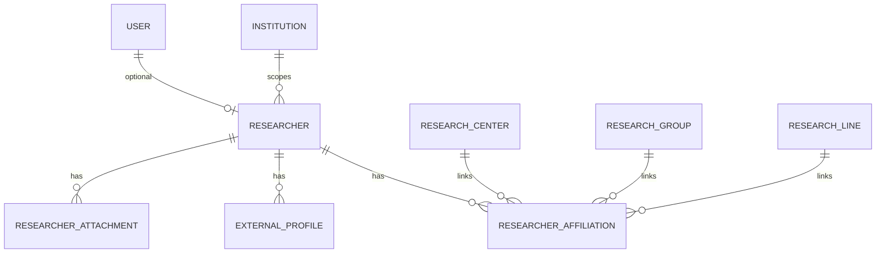

# Design: Researchers Module (SIGPI §6.3)

## Technical Approach

Researcher profiles as the third MVP module, following institutions patterns: institution-scoped models with denormalized `institution_id` for RLS, DRF ViewSets with nested routes, service-layer business logic, and defense-in-depth tenant isolation. No FSM — `is_active` boolean suffices per proposal. Researcher does NOT inherit `InstitutionScopedModel` literally (different field set, no FSM); it follows the same *scoping pattern* with its own fields.

## Architecture Decisions

| Decision | Option A | Option B | Choice | Rationale |
|----------|----------|----------|--------|-----------|
| Model base class | Inherit `InstitutionScopedModel` | Standalone model with `institution` FK | **Standalone** | InstitutionScopedModel carries `code`, `name`, `description`, `status` FSM — none apply to a researcher profile. Forced inheritance adds dead columns + FSM overhead. |
| Primary affiliation enforcement | DB partial unique index | `clean()` + `save()` validation | **`clean()` + `save()`** | Matches `InstitutionMembership.is_primary` pattern in accounts. Partial unique indexes are fragile across Django migrations. |
| Nested route style | `drf-nested-routers` | Manual `path()` like institutions | **Manual `path()`** | Follow existing convention — zero new dependencies. |
| Completeness calculation | DB computed column | Serializer `SerializerMethodField` | **Serializer method** | Keeps formula visible in Python, testable without DB, matches "computed property on serializer" from proposal. |
| Affiliation cross-entity validation | DB constraint | `clean()` on model | **`clean()` on model** | Matches institutions pattern (Facultad.clean validates sede.institution). DB CHECK can't reference other tables. |

## Data Model



### Researcher (`researchers_researcher`)

| Field | Type | Constraints |
|-------|------|-------------|
| `id` | `UUIDField` | PK, `default=uuid4` |
| `user` | `FK(User)` | `null=True, blank=True, unique=True` |
| `institution` | `FK(Institution)` | `related_name='researchers'` |
| `first_name` | `CharField(150)` | required |
| `last_name` | `CharField(150)` | required |
| `document_type` | `CharField(30)` | required (CC, TI, CE, PA) |
| `document_number` | `CharField(30)` | required |
| `primary_email` | `EmailField` | required |
| `phone` | `CharField(30)` | `blank=True` |
| `bio` | `TextField` | `blank=True` |
| `academic_formation` | `CharField(100)` | `blank=True` |
| `is_active` | `BooleanField` | `default=True` |
| `created_at` | `DateTimeField` | `auto_now_add` |
| `updated_at` | `DateTimeField` | `auto_now` |

**Constraints**: `UniqueConstraint(institution, document_number)` per RN-001.
**Indexes**: `(institution, is_active)`, `(user)` unique partial WHERE NOT NULL.

### ResearcherAffiliation (`researchers_researcheraffiliation`)

| Field | Type | Constraints |
|-------|------|-------------|
| `id` | `UUIDField` | PK |
| `researcher` | `FK(Researcher)` | `related_name='affiliations'` |
| `center` | `FK(ResearchCenter)` | `null=True, blank=True` |
| `group` | `FK(ResearchGroup)` | `null=True, blank=True` |
| `line` | `FK(ResearchLine)` | `null=True, blank=True` |
| `is_primary` | `BooleanField` | `default=False` |
| `created_at` | `DateTimeField` | `auto_now_add` |

**Constraints**: At least one of (center, group, line) NOT NULL — enforced in `clean()`. One `is_primary=True` per researcher — enforced in `clean()` + `save()`. All FK targets must belong to `researcher.institution` — enforced in `clean()`.

### ExternalProfile (`researchers_externalprofile`)

| Field | Type | Constraints |
|-------|------|-------------|
| `id` | `UUIDField` | PK |
| `researcher` | `FK(Researcher)` | `related_name='external_profiles'` |
| `provider` | `CharField(20)` | `choices=ProviderChoices` |
| `url` | `URLField` | required |
| `created_at` | `DateTimeField` | `auto_now_add` |

**ProviderChoices**: `cvlac`, `orcid`, `google_scholar`, `linkedin`, `researchgate`.

### ResearcherAttachment (`researchers_researcherattachment`)

| Field | Type | Constraints |
|-------|------|-------------|
| `id` | `UUIDField` | PK |
| `researcher` | `FK(Researcher)` | `related_name='attachments'` |
| `name` | `CharField(255)` | required |
| `type` | `CharField(20)` | `choices=TypeChoices` |
| `external_url` | `URLField` | required |
| `created_at` | `DateTimeField` | `auto_now_add` |

**TypeChoices**: `cv`, `certificate`, `photo`, `other`.

## Service Layer

### ResearcherProfileService

```python
class ResearcherProfileService:
    @staticmethod
    def create(institution, validated_data, user=None) -> Researcher: ...

    @staticmethod
    def update(researcher, validated_data) -> Researcher: ...

    @staticmethod
    def deactivate(researcher) -> Researcher: ...

    @staticmethod
    def calculate_completeness(researcher) -> int:
        """Count populated mandatory fields / total mandatory fields * 100.
        Mandatory: first_name, last_name, document_type, document_number,
        primary_email, at least one affiliation, at least one external profile."""
```

### ResearcherAffiliationService

```python
class ResearcherAffiliationService:
    @staticmethod
    def add(researcher, center=None, group=None, line=None, is_primary=False): ...

    @staticmethod
    def remove(affiliation): ...

    @staticmethod
    def set_primary(affiliation):
        """Unset current primary, set new one. Atomic transaction."""
```

## API Design

### ViewSets & Permissions

| ViewSet | Permission Classes | Notes |
|---------|-------------------|-------|
| `ResearcherViewSet` | `[IsAuthenticated, IsInstitutionAdminOrReadOnly, IsSameInstitution]` | List/detail use `ResearcherListSerializer`; retrieve uses `ResearcherSerializer`; create uses `ResearcherCreateSerializer` |
| `ResearcherAffiliationViewSet` | `[IsAuthenticated, IsInstitutionAdminOrReadOnly]` | Nested under `/researchers/{pk}/affiliations/` |
| `ExternalProfileViewSet` | `[IsAuthenticated, IsResearcherOrReadOnly]` | Nested under `/researchers/{pk}/profiles/` |
| `ResearcherAttachmentViewSet` | `[IsAuthenticated, IsResearcherOrReadOnly]` | Nested under `/researchers/{pk}/attachments/` |

### New Permission: `IsResearcherOrReadOnly`

```python
class IsResearcherOrReadOnly(BasePermission):
    """Write: user is the researcher owning the profile (level ≤ 4).
    Read: any authenticated user in same institution."""
    def has_permission(self, request, view):
        if request.method in SAFE_METHODS:
            return request.user.is_authenticated
        return HasRoleLevelOrHigher.has_level(request, 4)

    def has_object_permission(self, request, view, obj):
        if request.method in SAFE_METHODS:
            return True
        researcher = obj if isinstance(obj, Researcher) else obj.researcher
        return researcher.user_id == request.user.id or HasRoleLevelOrHigher.has_level(request, 2)
```

### URL Routing

```
/researchers/                              GET, POST
/researchers/{id}/                         GET, PATCH, DELETE
/researchers/{id}/affiliations/            GET, POST
/researchers/{id}/affiliations/{aff_id}/   PATCH, DELETE
/researchers/{id}/profiles/               GET, POST
/researchers/{id}/profiles/{prof_id}/     PATCH, DELETE
/researchers/{id}/attachments/            GET, POST
/researchers/{id}/attachments/{att_id}/   PATCH, DELETE
```

### Serializer Mapping

| Serializer | Use | Key Fields |
|-----------|-----|------------|
| `ResearcherListSerializer` | List | id, first_name, last_name, institution, is_active, completeness_score |
| `ResearcherSerializer` | Retrieve | All fields + nested affiliations, profiles, attachments |
| `ResearcherCreateSerializer` | Create/Update | Writable fields only; institution injected by view |
| `ResearcherAffiliationSerializer` | Affiliation CRUD | center, group, line, is_primary |
| `ExternalProfileSerializer` | Profile CRUD | provider, url |
| `ResearcherAttachmentSerializer` | Attachment CRUD | name, type, external_url |

## Security

### RLS Policies

4 new tables added to tenant isolation:

```sql
-- Applied to: researchers_researcher, researchers_researcheraffiliation,
--             researchers_externalprofile, researchers_researcherattachment
ALTER TABLE {table} ENABLE ROW LEVEL SECURITY;
CREATE POLICY tenant_isolation ON {table}
    USING (institution_id = current_setting('sigpi.institution_id')::uuid);
CREATE POLICY superadmin_bypass ON {table}
    USING (COALESCE(current_setting('sigpi.bypass_rls', true), 'false')::bool = true);
```

**Note**: `ResearcherAffiliation`, `ExternalProfile`, `ResearcherAttachment` have no `institution_id` column — they reach institution via `researcher_id` FK. RLS policy uses a JOIN or subquery:

```sql
-- For child tables (no direct institution_id):
CREATE POLICY tenant_isolation ON researchers_researcheraffiliation
    USING (researcher_id IN (
        SELECT id FROM researchers_researcher
        WHERE institution_id = current_setting('sigpi.institution_id')::uuid
    ));
```

### Permission Matrix

| Role | Create Researcher | Update Any | Update Own | Read All | Delete |
|------|:-:|:-:|:-:|:-:|:-:|
| Superadmin | ✅ | ✅ | ✅ | ✅ | ✅ |
| Admin | ✅ | ✅ | ✅ | ✅ | ✅ |
| Center Director | ✅ | ❌ | ✅ | ✅ | ❌ |
| Researcher | ❌ | ❌ | ✅ | ✅ | ❌ |
| Authenticated | ❌ | ❌ | ❌ | ✅ | ❌ |

## Migration Plan

| Migration | Depends On | Content |
|-----------|-----------|---------|
| `researchers/0001_initial.py` | `accounts.0003`, `institutions.0002` | Create 4 tables: Researcher, ResearcherAffiliation, ExternalProfile, ResearcherAttachment |
| `researchers/0002_rls_policies.py` | `researchers.0001` | Enable RLS + tenant_isolation + superadmin_bypass on 4 tables |

## Testing Strategy

| Layer | What | Approach |
|-------|------|----------|
| **Factories** | `ResearcherFactory`, `ResearcherAffiliationFactory`, `ExternalProfileFactory`, `ResearcherAttachmentFactory` | factory-boy in `conftest.py`, following institutions pattern |
| **Model tests** | Unique constraints, `clean()` validations, `is_primary` enforcement, completeness calc | pytest-django, `@pytest.mark.django_db` |
| **Service tests** | CRUD operations, affiliation add/remove/set_primary, completeness formula | Unit tests with mocked dependencies |
| **Serializer tests** | Field validation, nested serialization, completeness_score output | DRF test utilities |
| **Permission tests** | Role-based access matrix, self-profile edit, cross-institution denial | Fixture-based with role factories |
| **View tests** | CRUD endpoints, nested routes, error responses (409, 400, 403) | APIClient with authenticated users |
| **RLS tests** | Cross-institution query returns empty at DB level | PostgreSQL test DB with `SET ROLE sigpi_app` |
| **URL tests** | Route resolution, nested path correctness | Django `reverse()` assertions |

**Coverage target**: ≥80% (pytest-cov).

## File Changes

| File | Action | Description |
|------|--------|-------------|
| `backend/apps/researchers/__init__.py` | Create | Package init |
| `backend/apps/researchers/apps.py` | Create | `ResearchersConfig` |
| `backend/apps/researchers/models.py` | Create | 4 models: Researcher, ResearcherAffiliation, ExternalProfile, ResearcherAttachment |
| `backend/apps/researchers/services.py` | Create | ResearcherProfileService, ResearcherAffiliationService |
| `backend/apps/researchers/serializers.py` | Create | 6 serializers (list, detail, create, affiliation, profile, attachment) |
| `backend/apps/researchers/views.py` | Create | 4 ViewSets with nested route support |
| `backend/apps/researchers/permissions.py` | Create | `IsResearcherOrReadOnly` + re-exports from accounts |
| `backend/apps/researchers/urls.py` | Create | Manual nested path routing |
| `backend/apps/researchers/admin.py` | Create | Register all 4 models |
| `backend/apps/researchers/migrations/0001_initial.py` | Create | 4 tables |
| `backend/apps/researchers/migrations/0002_rls_policies.py` | Create | RLS for 4 tables |
| `backend/apps/researchers/tests/__init__.py` | Create | Test package |
| `backend/apps/researchers/tests/conftest.py` | Create | 4 factory-boy factories |
| `backend/apps/researchers/tests/test_models.py` | Create | Model constraint + validation tests |
| `backend/apps/researchers/tests/test_services.py` | Create | Service layer tests |
| `backend/apps/researchers/tests/test_serializers.py` | Create | Serializer tests |
| `backend/apps/researchers/tests/test_permissions.py` | Create | Permission matrix tests |
| `backend/apps/researchers/tests/test_views.py` | Create | ViewSet CRUD + nested route tests |
| `backend/apps/researchers/tests/test_urls.py` | Create | URL resolution tests |
| `backend/apps/researchers/tests/test_rls.py` | Create | RLS policy tests |
| `backend/apps/researchers/tests/test_admin.py` | Create | Admin registration tests |
| `backend/config/settings/base.py` | Modify | Add `apps.researchers` to `INSTALLED_APPS` |

## Open Questions

- [ ] Should `document_type` use `TextChoices` enum or free-text? Proposal implies choices (CC, TI, CE, PA) but spec doesn't enumerate.
- [ ] RLS on child tables (affiliation, profile, attachment) via subquery vs. denormalized `institution_id` column — subquery is cleaner but slightly slower; denormalized is faster but requires sync on researcher move (not in MVP scope).
