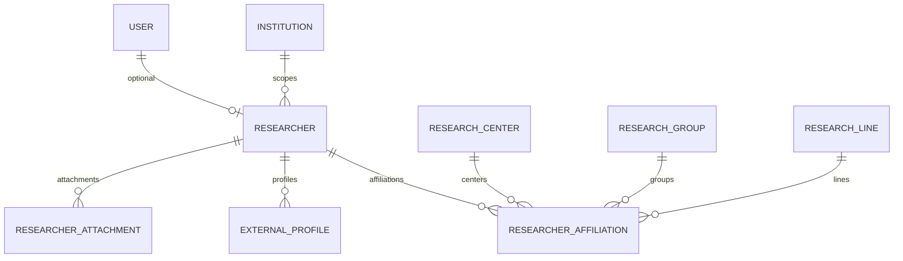

# Researchers Module Specification (SIGPI §6.3)

## Overview
Centralizes researcher profiles—academic, institutional, and external—as the third MVP module. Researchers are scoped to a single institution, linked optionally to a User, and affiliated to multiple centers/groups/lines via a junction table. Depends on `accounts` (User, RLS) and `institutions` (Institution, ResearchCenter, ResearchGroup, ResearchLine).

## Functional Requirements

| Code | Requirement | Scenario |
|---|---|---|
| RF-018 | Register researcher | **GIVEN** an Admin or Director **WHEN** they POST `/researchers/` **THEN** a Researcher is created with `is_active=True` |
| RF-019 | Update own profile | **GIVEN** an authenticated Researcher **WHEN** they PATCH their own `/researchers/{id}/` **THEN** the profile is updated |
| RF-020 | Affiliation M2M | **GIVEN** a Researcher in institution I **WHEN** they POST `/researchers/{id}/affiliations/` with center/group/line in I **THEN** a ResearcherAffiliation is created |
| RF-021 | External profiles | **GIVEN** a Researcher **WHEN** they POST `/researchers/{id}/profiles/` with `{provider, url}` **THEN** an ExternalProfile is stored |
| RF-023 | Manual external links | **GIVEN** automatic CvLAC sync is unavailable **WHEN** a user stores a profile URL manually **THEN** the link is readable via API |
| RF-024 | Profile completeness | **GIVEN** a Researcher missing a mandatory field **WHEN** they GET `/researchers/{id}/` **THEN** the response includes `completeness_score < 100` |
| RF-025 | Attachment metadata | **GIVEN** a Researcher **WHEN** they POST `/researchers/{id}/attachments/` with name, type, external_url **THEN** a metadata-only ResearcherAttachment is stored |

## Business Rules

| Code | Rule |
|---|---|
| RN-001 | `(institution, document_number)` MUST be unique. |
| RN-006 | Profile completeness MUST be marked incomplete when any mandatory field is null or no external profile exists. |
| RN-AFF-01 | A Researcher MUST belong to exactly one institution. |
| RN-AFF-02 | A Researcher MAY have multiple affiliations but exactly one MUST be `is_primary=True`. |
| RN-EXT-01 | `provider` choices MUST be `cvlac`, `orcid`, `google_scholar`, `linkedin`, `researchgate`. |
| RN-ATT-01 | `type` choices MUST be `cv`, `certificate`, `photo`, `other`. |

## Data Model

`Researcher` inherits from `InstitutionScopedModel` (denormalized `institution_id` for RLS).

| Entity | Key Fields | Constraints |
|---|---|---|
| **Researcher** | `id` (UUID PK), `user` (FK→User, nullable), `institution` (FK→Institution), `first_name`, `last_name`, `document_type`, `document_number`, `email`, `phone`, `bio`, `academic_formation`, `is_active` | `(institution, document_number)` unique |
| **ResearcherAffiliation** | `id`, `researcher` (FK), `center` (FK, null), `group` (FK, null), `line` (FK, null), `is_primary` | At least one FK set; one primary per researcher |
| **ExternalProfile** | `id`, `researcher` (FK), `provider` (TextChoices), `url` | — |
| **ResearcherAttachment** | `id`, `researcher` (FK), `name`, `type` (TextChoices), `external_url` | — |

## API Contract

| Endpoint | Method | Auth | Request Body | Response |
|---|---|---|---|---|
| `/researchers/` | GET, POST | Session | `{first_name, last_name, document_type, document_number, email, ...}` | List / Researcher |
| `/researchers/{id}/` | GET, PATCH, DELETE | Session | partial fields | Researcher / 204 |
| `/researchers/{id}/affiliations/` | GET, POST | Session | `{center?, group?, line?, is_primary}` | List / Affiliation |
| `/researchers/{id}/affiliations/{aff_id}/` | PATCH, DELETE | Session | `{is_primary}` | Affiliation / 204 |
| `/researchers/{id}/profiles/` | GET, POST | Session | `{provider, url}` | List / Profile |
| `/researchers/{id}/profiles/{prof_id}/` | PATCH, DELETE | Session | `{url}` | Profile / 204 |
| `/researchers/{id}/attachments/` | GET, POST | Session | `{name, type, external_url}` | List / Attachment |
| `/researchers/{id}/attachments/{att_id}/` | PATCH, DELETE | Session | `{name, external_url}` | Attachment / 204 |

## Security

- RLS policies MUST filter `researchers_researcher`, `researchers_researcheraffiliation`, `researchers_externalprofile`, `researchers_researcherattachment` by `institution_id`.
- Superadmin: full CRUD.
- Admin: full CRUD within institution.
- Center Director: create/read within institution; update own profile only.
- Researcher: read all researchers in institution; update own profile; manage own affiliations/profiles/attachments.
- Authenticated users: read researchers in their institution.

## Error Handling

| Error | Status | Response |
|---|---|---|
| Duplicate document per institution | 409 | `{"detail":"Document already exists for this institution."}` |
| Affiliation outside institution | 400 | `{"detail":"Affiliation entity does not belong to researcher's institution."}` |
| Multiple primary affiliations | 400 | `{"detail":"Only one primary affiliation allowed."}` |
| Invalid provider/type choice | 400 | `{"detail":"Invalid choice."}` |
| RLS institution violation | 403 | `{"detail":"Institution access denied."}` |

## Non-Functional Requirements

- Test coverage MUST be ≥80% (pytest, pytest-django, pytest-cov).
- TDD Red–Green–Refactor is mandatory for all researcher entities.
- API list response SHOULD be <200ms; detail <100ms.
- Model `clean()` MUST validate that affiliation targets (center/group/line) belong to the researcher's institution before save.
