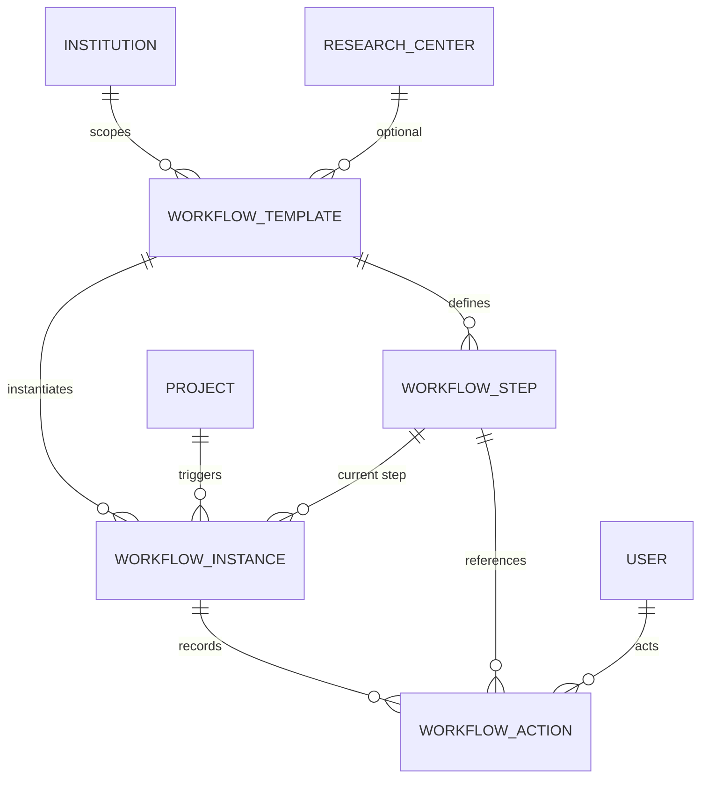

# Project Workflow Specification (SIGPI §6.5)

## Purpose

Thin approval-workflow layer on top of the existing 12-state Project FSM. Formalizes, tracks, and audits the approval process — starting with single-step director approval. Does NOT modify the Project model schema; integrates via Django signals.

---

## Functional Requirements

| Code | Requirement | Priority | Acceptance Criteria | Scenario |
|---|---|---|---|---|
| WF-001 | Workflow template management | Must | Admin can CRUD `WorkflowTemplate` with steps; default template seeded per center | **GIVEN** a Superadmin **WHEN** POST `/workflows/templates/` with name, center, steps **THEN** template created with ordered `WorkflowStep` rows |
| WF-002 | Auto-create workflow instance on submit | Must | `WorkflowInstance` created when Project transitions to `enviado`; idempotent (no duplicates) | **GIVEN** a Project in `borrador` with a valid template for its center **WHEN** PI POSTs `/projects/{id}/submit/` **THEN** a `WorkflowInstance` is created in `pending` with `deadline_date` computed from step's `deadline_days` |
| WF-003 | Workflow step actions (approve/observe/reject) | Must | Director actions create append-only `WorkflowAction`; instance advances to `completed`/`observed`/`rejected` | **GIVEN** a `WorkflowInstance` in `pending` for Project P **WHEN** Director POSTs `/workflows/instances/{id}/approve/` **THEN** a `WorkflowAction(action="approve")` is created AND instance status is `completed`  **GIVEN** a `WorkflowInstance` in `pending` **WHEN** Director POSTs `/workflows/instances/{id}/observe/` with `observation_text` **THEN** `WorkflowAction(action="observe")` created AND instance status is `observed` |
| WF-004 | Minimum-data completeness guard | Must | Approval blocked if required project fields are missing (CA-005) | **GIVEN** a Project with empty `methodology` **WHEN** Director attempts approve **THEN** 400 "Minimum data requirements not met" AND no `WorkflowAction` created |
| WF-005 | Deadline tracking | Must | `deadline_date` computed on creation; overdue annotation available on queryset | **GIVEN** a `WorkflowInstance` created 10 days ago with `deadline_days=7` **WHEN** GET `/workflows/instances/?overdue=true` **THEN** instance is returned with `is_overdue=true` |
| WF-006 | Append-only audit trail | Must | Every action on a step creates immutable `WorkflowAction`; no update/delete endpoints | **GIVEN** a `WorkflowAction` exists **WHEN** any user attempts PATCH or DELETE **THEN** 405 Method Not Allowed |
| WF-007 | Workflow instance listing & detail | Must | Filterable by project, status, center, overdue flag | **GIVEN** 3 instances with statuses `pending`, `completed`, `observed` **WHEN** GET `/workflows/instances/?status=pending` **THEN** only pending instance returned |
| WF-008 | Resubmit after observation resets instance | Must | When observed Project is resubmitted, existing instance transitions back to `pending` | **GIVEN** a `WorkflowInstance` in `observed` **WHEN** PI POSTs `/projects/{id}/resubmit/` **THEN** instance status returns to `pending` AND a new `WorkflowAction(action="resubmit")` is created |

## Business Rules

| Code | Rule |
|---|---|
| WR-001 | Exactly one active `WorkflowInstance` per Project at any time (idempotent creation). |
| WR-002 | `WorkflowAction` records are append-only; no UPDATE or DELETE permitted. |
| WR-003 | Only a Center Director of the project's center MAY take approve/observe/reject actions (mirrors RN-010). |
| WR-004 | Minimum-data guard MUST pass before `approve` action is recorded. |
| WR-005 | `deadline_date` = `created_at` + `WorkflowStep.deadline_days`. |
| WR-006 | Workflow tables MUST be RLS-scoped by `institution_id`. |
| WR-007 | Workflow creation and Project state transition MUST be atomic (`transaction.atomic()`). |

## Data Model

| Entity | Key Fields | Constraints |
|---|---|---|
| **WorkflowTemplate** | `id` (UUID PK), `institution` (FK→Institution), `center` (FK→ResearchCenter, nullable), `name`, `description`, `is_active`, `created_at`, `updated_at` | `(institution, name)` unique; inherits `InstitutionScopedModel` |
| **WorkflowStep** | `id` (UUID PK), `template` (FK→WorkflowTemplate), `order` (int), `role_required` (TextChoices: `center_director`), `deadline_days` (int, default 15), `name`, `description` | `(template, order)` unique; `deadline_days > 0` |
| **WorkflowInstance** | `id` (UUID PK), `project` (FK→Project, read-only ref), `institution` (FK→Institution), `template` (FK→WorkflowTemplate), `current_step` (FK→WorkflowStep, nullable), `status` (TextChoices: `pending`, `completed`, `observed`, `rejected`, `cancelled`), `deadline_date` (DateTime, nullable), `created_at`, `updated_at` | One active instance per project; `institution_id` denormalized for RLS |
| **WorkflowAction** | `id` (UUID PK), `instance` (FK→WorkflowInstance), `step` (FK→WorkflowStep), `action` (TextChoices: `create`, `approve`, `observe`, `reject`, `resubmit`, `cancel`), `acted_by` (FK→User, SET_NULL), `observation_text` (nullable), `metadata` (JSONB, nullable), `created_at` | Append-only; no update/delete |

## API Contract

| Endpoint | Method | Auth | Request Body | Response |
|---|---|---|---|---|
| `/workflows/templates/` | GET, POST | Session | `name`, `center?`, `steps[]` | List / Template |
| `/workflows/templates/{id}/` | GET, PATCH, DELETE | Session | partial | Template / 204 |
| `/workflows/instances/` | GET | Session | query: `project`, `status`, `center`, `overdue` | List Instance (with `is_overdue` annotation) |
| `/workflows/instances/{id}/` | GET | Session | — | Instance + actions[] |
| `/workflows/instances/{id}/approve/` | POST | Session | — | Instance |
| `/workflows/instances/{id}/observe/` | POST | Session | `observation_text` | Instance |
| `/workflows/instances/{id}/reject/` | POST | Session | `reason` | Instance |

## Security & Permissions

| Action | Superadmin | Admin | Center Director | PI | Other |
|---|---|---|---|---|---|
| CRUD templates | ✓ | ✓ | — | — | — |
| List/view instances | ✓ | ✓ | ✓ (own center) | ✓ (own projects) | — |
| Approve / Observe / Reject | ✓ | ✓ | ✓ (RN-010) | — | — |
| View actions (audit) | ✓ | ✓ | ✓ | ✓ | — |

Permission classes: `IsCenterDirectorForProject` (reuse), `HasRoleLevelOrHigher` for template CRUD, `InstitutionRLS` via queryset filtering.

## FSM Integration

**Signal-based approach — zero schema changes to Project model:**

1. `projects/services.py` emits `project_state_changed` signal inside `_log_transition()` within `transaction.atomic()`.
2. `project_workflow/signals.py` receiver listens for `project_state_changed`:
   - `to_state="enviado"` → `WorkflowService.create_instance(project)` (idempotent)
   - `to_state="observado"` → no instance change (instance stays `observed`)
   - `to_state="enviado"` from `observado` (resubmit) → `WorkflowService.reset_instance(instance)` to `pending`
   - Terminal states → `WorkflowService.cancel_instance(instance)` if still active
3. `WorkflowService.check_minimum_data(project)` called as pre-guard inside approve action (not inside FSM transition — keeps workflow logic in workflow module).
4. All workflow mutations emit `AuditEvent` via `AuditEventEmitter` with event types: `WORKFLOW_INSTANCE_CREATED`, `WORKFLOW_ACTION_TAKEN`, `WORKFLOW_DEADLINE_MISSED`.

## Testing Strategy

| Aspect | Requirement |
|---|---|
| Markers | `@pytest.mark.django_db`, `@pytest.mark.workflow` custom marker |
| Coverage | ≥80% (config.yaml `coverage_floor`); models, services, signals, API |
| TDD | Strict Red-Green-Refactor per `config.yaml` `strict_tdd: true` |
| Unit tests | Model validation, business rules (WR-001 to WR-007), service methods |
| Integration tests | Signal flow (Project submit → WorkflowInstance created), atomic transactions, RLS enforcement |
| API tests | DRF `APITestCase` for all endpoints, permission matrix, error responses |
| Edge cases | Idempotent instance creation, overdue annotation accuracy, minimum-data guard with partial fields, resubmit cycle |

---

## Delta: Projects Module (Modified Capability)

### ADDED: Signal emission hook in `_log_transition()`

The `projects` module MUST emit a `project_state_changed` Django signal after every successful FSM transition, carrying `project`, `from_state`, `to_state`, `triggered_by`. No Project model schema changes.

#### Scenario: Signal emitted on submit

- GIVEN a Project transitioning from `borrador` to `enviado`
- WHEN `_log_transition()` completes inside `transaction.atomic()`
- THEN `project_state_changed` signal is dispatched with correct payload

#### Scenario: Signal atomic with FSM transition

- GIVEN a `WorkflowInstance` creation fails
- WHEN the signal receiver raises an exception
- THEN the entire transaction rolls back (Project state unchanged)
